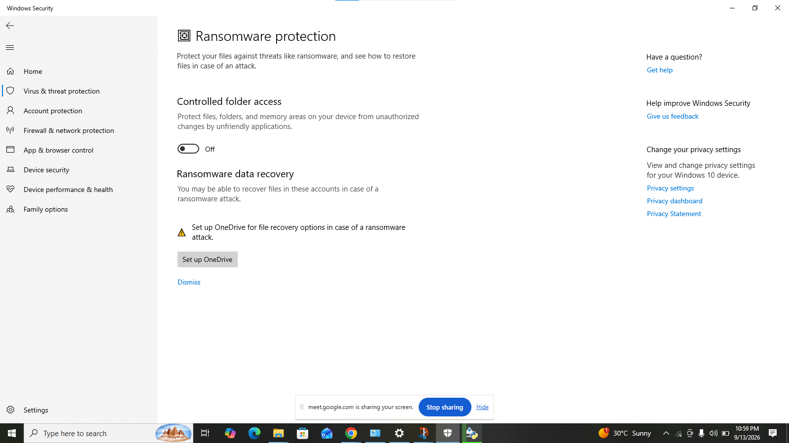
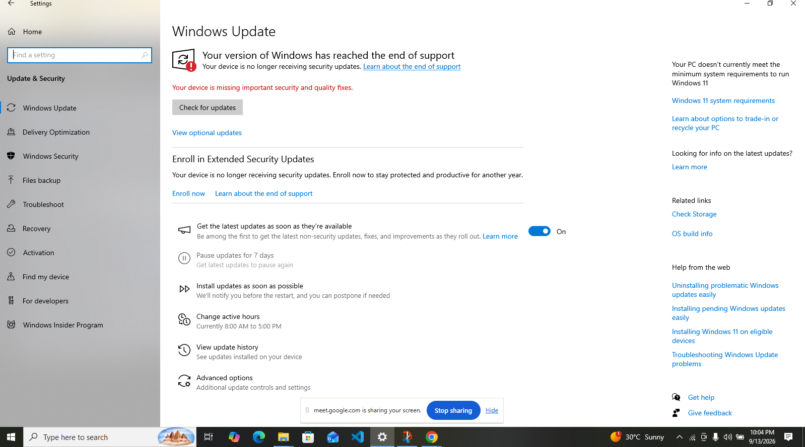

# System Security Audit Report

**Project:** System Security Audit
**Target System:** Dell PC — Windows 10 (Local Account)
**Audit Date:** September 13, 2026
**Prepared By:** Internal Security Review

---

## 1. Executive Summary

This report documents a self-conducted security audit of a personal Windows 10 workstation. The audit reviewed Windows Security protection areas (virus/threat protection, account protection, firewall/network, app & browser control, device security, device health), ransomware protection settings, Windows Update/activation status, and general system hygiene.

**Overall Risk Level: Medium-High**

The system has no active malware and firewall protection is functioning correctly, but it is running an end-of-support Windows 10 build with no further security updates, an unactivated Windows license, and several hardening features left in their default/off state (Windows Hello, ransomware controlled folder access, potentially-unwanted-app blocking).

| Category | Status |
|---|---|
| Virus & Threat Protection | ⚠️ Actions Recommended |
| Account Protection | ⚠️ Actions Recommended |
| Firewall & Network Protection | ✅ No Action Needed |
| App & Browser Control | ⚠️ Actions Recommended |
| Device Security | ✅ No Action Needed (limited by hardware) |
| Device Performance & Health | ✅ No Issues |
| Ransomware Protection | ⚠️ Actions Recommended |
| Windows Update / OS Support | 🔴 Critical — End of Support |
| Windows Activation | 🔴 Critical — Not Activated |

---

## 2. Scope & Methodology

The audit was performed manually using the built-in **Windows Security** app and **Settings** panel on the target device. Screenshots were captured of each protection area as evidence. No third-party scanning tools were used. This is a point-in-time configuration review, not a penetration test.

---

## 3. Findings

### 3.1 Windows Security — Overview

The Windows Security home screen summarizes all protection areas. At the time of the audit, three areas required action: Virus & threat protection, Account protection, and App & browser control.

---

### 3.2 Virus & Threat Protection

A quick scan was run and completed with **0 threats found** (37,705 files scanned in ~7 minutes 24 seconds). Security intelligence (virus definitions) was up to date as of 9/13/2026.

**Finding:** No active infections detected. Ransomware protection under this section prompts for OneDrive setup, which has not been configured (see §3.7).

---

### 3.3 Account Protection

The device uses a **local Dell account**, not signed in to a Microsoft account. As a result:
- **Windows Hello** (biometric/PIN sign-in) is **not set up**.
- **Dynamic lock** is **not set up**.

**Risk:** The account currently relies on whatever basic local sign-in method is configured, without hardware-backed biometric or PIN authentication, and without dynamic lock to automatically secure the session when the user steps away.

---

### 3.4 Firewall & Network Protection

All three firewall profiles are **enabled**:
- Domain network — Firewall ON
- Private network — Firewall ON
- Public network (active profile) — Firewall ON

**Finding:** No action needed. The firewall is correctly active on the currently-connected (public) network profile.

---

### 3.5 App & Browser Control

**Reputation-based protection** — the setting to **block potentially unwanted apps (PUA) is turned OFF**. Windows explicitly flags the device as potentially vulnerable as a result.

Exploit protection remains on default, Microsoft-recommended settings.

**Risk:** Without PUA blocking, the device is more exposed to adware, bundled unwanted software, and low-grade malicious downloads.

---

### 3.6 Device Security

- **Security processor (TPM)** is present and providing additional encryption support.
- **Standard hardware security is not supported** on this device.

**Finding:** No user action available here — this is a hardware capability limitation rather than a misconfiguration. It does mean the device cannot benefit from certain modern hardware-backed protections (e.g., full Windows 11 hardware security baseline).

---

### 3.7 Ransomware Protection

- **Controlled folder access** is **OFF**.
- **Ransomware data recovery** via OneDrive is **not set up** (prompted, not dismissed as configured).

**Risk:** Protected folders (Documents, Desktop, Pictures, etc.) are not shielded from unauthorized modification by untrusted applications, and there is no cloud-based recovery path configured in the event of a ransomware incident.

---

### 3.8 Device Performance & Health

All four monitored health areas report **No issues**:
- Windows Time service
- Apps and software
- Storage capacity
- Battery life

**Finding:** No action needed. General system health is good.

---

### 3.9 Windows Update & OS Support Status (Critical)

This is the most significant finding of the audit:

- **"Your version of Windows has reached the end of support."**
- **"Your device is no longer receiving security updates."**
- **"Your device is missing important security and quality fixes."**
- The PC **does not meet the minimum system requirements to run Windows 11**.
- **Extended Security Updates (ESU)** enrollment is available but has not been completed.

**Risk: Critical.** An unpatched, end-of-life operating system is the single largest exposure on this system — it will not receive fixes for newly discovered vulnerabilities, regardless of how well other settings (firewall, antivirus) are configured.

---

### 3.10 Windows Activation Status (Critical)

The Settings home page shows: **"Windows isn't activated. Activate Windows now."**

**Risk:** An unactivated copy of Windows may not reliably receive updates and indicates a licensing compliance gap that should be resolved.

---

### 3.11 Project File Organization Reference

For completeness, the working drive (Local Disk E:) folder structure at the time of the audit is included below for project record-keeping purposes.

---

## 4. Risk Summary Table

| # | Finding | Severity | Recommendation |
|---|---|---|---|
| 1 | Windows 10 has reached end of support / missing security updates | Critical | Upgrade to Windows 11 (if hardware allows) or enroll in Extended Security Updates (ESU) immediately |
| 2 | Windows is not activated | Critical | Activate Windows with a valid license |
| 3 | Block potentially unwanted apps (PUA) is OFF | High | Turn on reputation-based PUA blocking in App & browser control |
| 4 | Controlled folder access (ransomware protection) is OFF | High | Enable controlled folder access and add protected folders |
| 5 | No cloud backup / ransomware recovery configured | Medium | Set up OneDrive (or an alternative backup) for file recovery |
| 6 | Windows Hello not set up | Medium | Configure PIN or biometric sign-in for stronger authentication |
| 7 | Dynamic lock not set up | Low | Pair a Bluetooth device and enable Dynamic Lock |
| 8 | Standard hardware security not supported | Informational | Hardware limitation; consider for future hardware refresh planning |
| 9 | Firewall (all profiles) | None — Healthy | No action required |
| 10 | Device performance & health | None — Healthy | No action required |
| 11 | Antivirus scan | None — Healthy | 0 threats found; keep definitions up to date |

---

## 5. Prioritized Recommendations

1. **Immediate:** Activate Windows and either upgrade the device to Windows 11 (if it meets requirements) or enroll in Extended Security Updates to keep receiving patches.
2. **Immediate:** Turn on "Block potentially unwanted apps" under App & browser control.
3. **Short-term:** Enable Controlled folder access and configure OneDrive (or another backup solution) for ransomware recovery.
4. **Short-term:** Set up Windows Hello (PIN/biometric) sign-in instead of relying solely on the local account password.
5. **Optional:** Configure Dynamic Lock if a paired Bluetooth device (e.g., phone) is available.
6. **Ongoing:** Continue running periodic quick/full scans and keep Microsoft Defender definitions updated.

---

## 6. Conclusion

The system shows sound baseline hygiene in the areas of firewall configuration, malware scanning, and general device health, with no threats detected at the time of audit. However, the device carries **critical exposure** from running an unsupported, unpatched, and unactivated Windows installation. This should be treated as the top remediation priority, followed by hardening app control and ransomware protection settings.

---

*End of Report*
